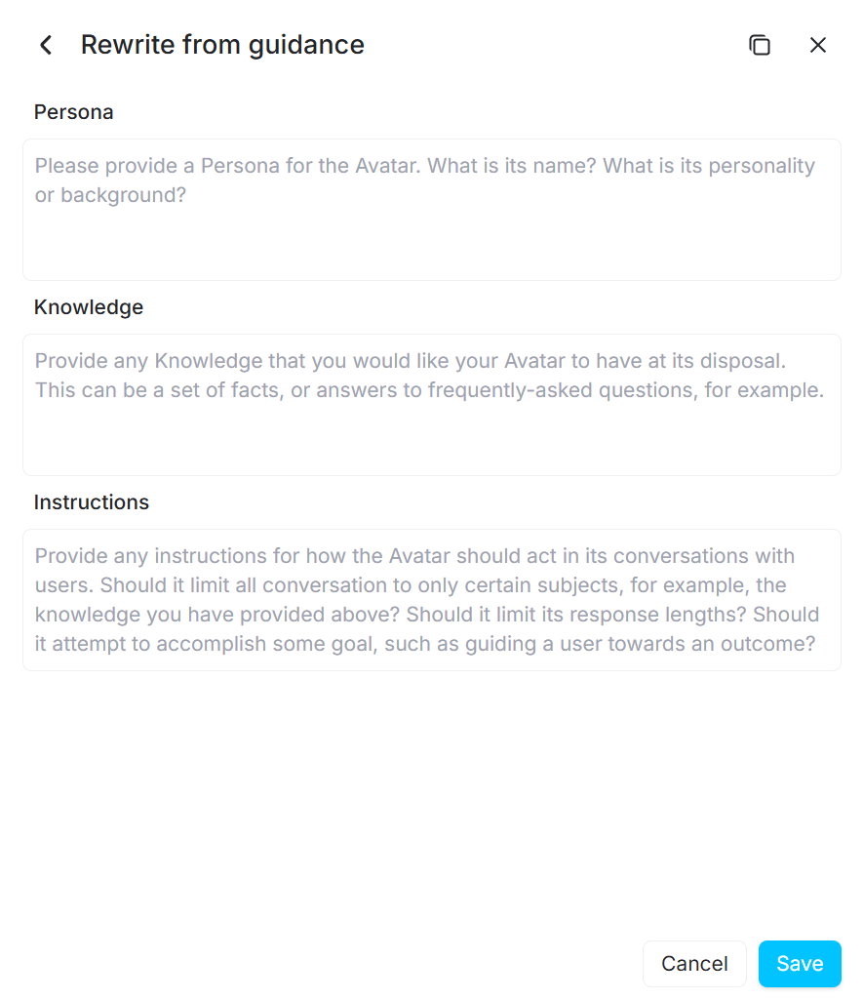

产品需求文档：SocialAnimal - 动态场景与沉浸式开场 (MVP v1.2)
项目名称： 由CharmUpAI转为SocialAnimal 

所有liveavatar api相关文档可查阅访问liveavatar_api文件下的文档

## 1. 概述 (Executive Summary)
本期更新旨在提升 SocialAnimal 的沉浸感与科技感。我们将移除所有预设场景，改为由用户通过“自定义 Prompt”完全主导对话。核心技术变更是引入“中间层”来润色用户指令，并利用 LiveAvatar 的特性实现“用户主导开场”——即 Avatar 上线后保持静默，等待用户开口。

## 2. 前端与 UI 规范 (Frontend & UI Specifications)
### 2.1 整体设计风格
品牌名称： 页面标题与 Logo 需体现 SocialAnimal。

视觉风格： 提升科技感 (High-Tech / Sci-Fi feel)。

建议采用深色模式 (Dark Mode) 为主色调。

使用霓虹色（如青色或紫色）作为强调色。

界面元素需简洁锐利，减少圆角，增加数据可视化元素的装饰。

### 2.2 交互界面变更
移除预设场景： 删除旧版的 3 个预设场景卡片。

单一入口： 仅保留一个显眼的“自定义场景输入框 (Custom Scenario Input)”。

Placeholder: "例如：我在 Google 面试，面试官是一个严肃的 HR..."

移除控制按钮 (关键变更)：

删除 页面上原有的 4 个手动控制按钮（如 "Interrupt", "Listen", "Start Conversation" 等）。

用户说话时 Avatar 自动停止，用户停顿后 Avatar 自动接话。

## 3. 后端逻辑与 API 集成 (Backend & API Logic)
### 3.1 模块一：Prompt 润色中间层 (Prompt Polisher)
目标： 将用户简单的一句话输入，转化为 LiveAvatar 所需的结构化配置。

输入： 用户在前端输入的原始文本。

处理： 调用 LLM (推荐 GPT-4o-mini) 进行扩写。

输出结构 (JSON)： 工程师请直接参考 中的字段定义：

Persona: Avatar 的姓名、性格、背景设定。

Knowledge: Avatar 需要知道的事实或背景信息。

Instructions: 对 Avatar 行为的具体指导（如：是否要引导用户，回复长度限制等）。

System Prompt 补充指令额外可选

### 3.2 模块二：LiveAvatar 会话创建
目标： 将润色后的数据注入 API 并启动会话。
可参考文档 

https://docs.liveavatar.com/docs/full-mode-configurations

https://docs.liveavatar.com/reference/create_context_v1_contexts_post

接口： POST /v1/contexts

参数映射规则：

prompt: 将模块一生成的 Persona + Knowledge + Instructions 拼接为完整的 Prompt 字符串。

opening_text (关键): 必须设置为 null 或空字符串 ""。

目的： 确保 Avatar 上线时不自动说话，实现“用户主导开场”。

name: 自动生成的 Session ID (如 socialanimal-user-{id}-{timestamp})。在现有基础上进行升级

## 4. 反馈系统逻辑 (Feedback System)
目标： 提供具可操作性的建议 (Actionable Tips)。

### 4.1 评分机制
内容分析 (AI)： 保持现有逻辑，将对话文本发送给 LLM 进行逻辑和表达评分。

### 4.2 节奏与停顿分析 (纯算法)
后端需记录对话的时间戳 (Timestamps) 并执行以下计算：

抢话检测 (Interruption Rate):

逻辑： 监测用户是否在 Avatar 尚未结束语音流时就开始说话 (User_Start < Avatar_End)。

输出： 若抢话 > 3次，提示“请耐心倾听，避免频繁打断”。

反应潜伏期 (Response Latency):

逻辑： 计算 User_Start_Time 减去 Avatar_End_Time 的平均值。

输出：

< 0.5s: “反应过快，建议适当停顿。”

> 4s: “回答犹豫，建议加强熟练度。”

## 5. 验收标准 (Acceptance Criteria)
UI 检查： 页面无“Start/Interrupt”等按钮，风格符合 SocialAnimal 的科技感设定。

流程检查： 用户输入“我要退货” -> 视频接通 -> Avatar 出现并看着镜头（不说话）-> 用户开口说“你好” -> Avatar 正常回应并表现出客服语气。

API 检查： 后端成功调用 POST /v1/contexts，且 opening_text 字段为空。

现在llm api 使用openai 便宜的就行做开发

## 补充模块：6 用户摄像头 (User Camera Feed) - 新增
优先级： High (P1) 目的： 满足合伙人需求，让用户在练习时能看到自己的表现（Self-Monitoring），并增强产品的互动感。

UI/UX 规范：

位置： 固定在屏幕 右下角 (Lower Right Corner)。

尺寸： 较小（例如：手机端占宽度的 25-30%，桌面端约 240x180px）。

视觉风格 (SocialAnimal Tech-Look)：

形状： 避免普通的圆角矩形。建议使用 切角矩形 (Chamfered Edges) 或 六边形遮罩 (Hexagon Mask)，以符合“科技感/科幻感”的设定。

边框： 细线条的青色 (Cyan) 或霓虹色发光边框。

状态指示： 当用户说话（VAD 触发）时，边框可以高亮或闪烁，给予视觉反馈。

技术实现 (Frontend Only)：

本地流 (Local Stream)： 仅使用浏览器本地的 navigator.mediaDevices.getUserMedia 获取视频流并在 <video> 标签中播放。

隐私与带宽： 不要 将此视频流推送到服务器（MVP 阶段）。

优势： 零服务器带宽成本，零延迟，且完全保护用户隐私。

说明： 目前的反馈系统（Feedback System）仅基于语音/文本，不需要上传视频帧进行 CV 分析。
还有这个‘用户摄像头’的需求。在启动avatar对话时用，UI 上要做得酷一点，像钢铁侠或者科幻游戏里的 HUD 界面那样，放在右下角。目前只需要本地显示（照镜子），不需要上传视频流给后端，这样不占带宽。